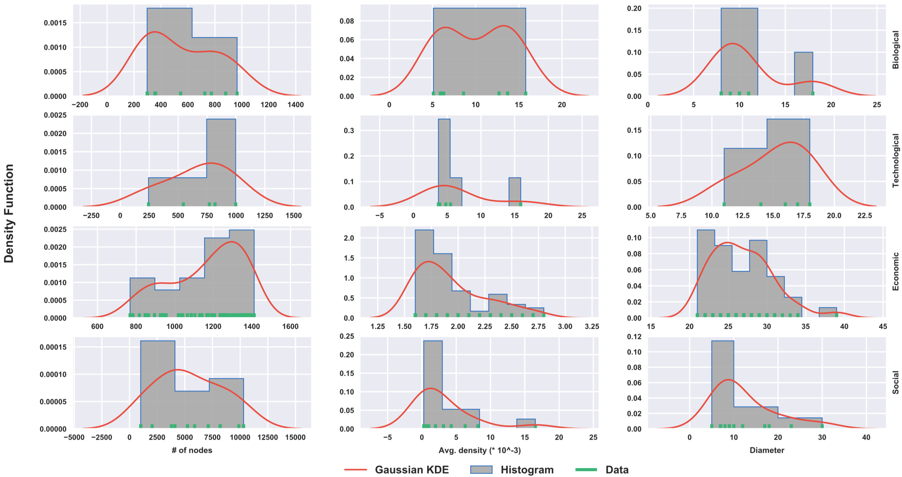
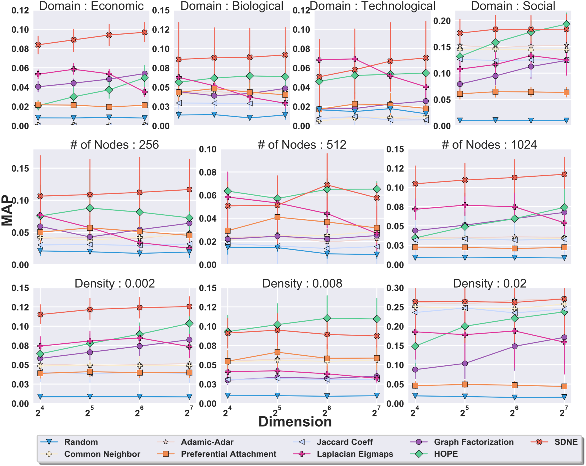

# GEM-benchmark: Benchmark for Graph Embedding Methods
Graph embedding, which refers to the task of representing nodes of a graph in a low-dimensional space, has gained significant traction in the past few years, with applications including link prediction, node classification, and graph visualization. Many methods have been proposed for this task which primarily differs in the inherent properties being preserved from the original graph. However, comparing such methods is challenging. Most methods show performance boosts on just a few selected networks. Such performance improvement may be due to fluctuations or specific properties of the networks at hand, thus being often inconclusive when comparing methods on different networks. To conclusively determine the utility and advantages of an approach, one would need to make a comparison on several such networks. In this work, we introduce a principled framework to compare graph embedding methods. We test embedding methods on a corpus of real-world networks with varying properties and provide insights into existing state-of-the-art embedding approaches. We cluster the input networks in terms of their properties to get a better understanding of embedding performance. Furthermore, we compare embedding methods with traditional link prediction techniques to evaluate the utility of embedding approaches. We use the comparisons on benchmark graphs to define a score, called GFS-score, that can apply to measure any embedding method. We rank the state-of-the-art embedding approaches using the GFS-score and show that it can be used to understand and evaluate a novel embedding approach. We envision that the proposed framework may serve as a community benchmark to test and compare the performance of future graph embedding techniques.

``GEM-benchmark`` is a Python package which offers a general framework to benchmark graph embedding methods. It has a suite of 100 real graphs and 12 synthetic graph generators and results of 9 link prediction methods on these 100 graphs. A paper showcasing the results using ``GEM-benchmark`` on various real world datasets can be accessed through [Benchmarks for Graph Embedding Evaluation](https://arxiv.org/abs/1908.06543).

``GEM-benchmark`` readme can also be accessed as [https://palash1992.github.io/GEM-Benchmark/](https://palash1992.github.io/GEM-Benchmark/).

The suite of 100 real graphs are primarily subsets of [CommunityFitNet](https://github.com/Aghasemian/CommunityFitNet) and [SNAP](http://snap.stanford.edu/). Please cite these references when using the real graphs.

The module was developed and is maintained by Palash Goyal, Di Huang, Ankita Gowswami and Sujit Rokka Chhetri.

## Implemented Methods
GEM-benchmark implements the following graph embedding techniques:
* [Preferential Attachment](https://science.sciencemag.org/content/286/5439/509)
* [Common Neighbors](https://arxiv.org/pdf/cond-mat/0104209)
* [Adamic-Adar](social.cs.uiuc.edu/class/cs591kgk/friendsadamic.pdf)
* [Jaccard's Coefficient](https://ci.nii.ac.jp/naid/10020758887/)
* [Laplacian Eigenmaps](http://yeolab.weebly.com/uploads/2/5/5/0/25509700/belkin_laplacian_2003.pdf)
* [Locally Linear Embedding](http://www.robots.ox.ac.uk/~az/lectures/ml/lle.pdf)
* [Graph Factorization](https://static.googleusercontent.com/media/research.google.com/en//pubs/archive/40839.pdf)
* [Higher-Order Proximity preserved Embedding (HOPE)](http://www.kdd.org/kdd2016/papers/files/rfp0184-ouA.pdf)
* [Structural Deep Network Embedding (SDNE)](http://www.kdd.org/kdd2016/papers/files/rfp0191-wangAemb.pdf)
* [node2vec](http://www.kdd.org/kdd2016/papers/files/rfp0218-groverA.pdf)

## Dependencies
GEM is tested to work on Python 3.6

The required dependencies are: Numpy >= 1.12.0, SciPy >= 0.19.0, Networkx >= 2.1, Scikit-learn >= 0.18.1.

To run SDNE, GEM requires Theano >= 0.9.0 and Keras = 2.0.2.

## Install
The package uses setuptools, which is a common way of installing python modules. To install in your home directory, use:
```bash
    pip3 install -r requirements.txt --user
```

To install for all users on Unix/Linux:
```bash 
    sudo pip3 install -r requirements.txt
```

To install node2vec as part of the package, recompile from https://github.com/snap-stanford/snap and add node2vec executable to system path.
To grant executable permission, run: chmod +x node2vec

## Usage
### Example 1
Plot the real graph statistics and benchmark plots.

```python
from gem.utils import plot_util, plot_stats, gfs_score

# Plot statistics of real graphs
plot_stats.plot_real_stats(
	in_file='gem-ben/real_graphs_list_100.h5',
	out_file='realgraphProps.pdf'
)

# Plot benchmark results
methods = ['rand', 'pa', 'cn', 'aa', 'jc',
           'gf', 'lap', 'hope', 'sdne']
plot_util.plot_benchmark(methods, metric='MAP', s_sch='rw')

# Get GFS-scores
gfs_score.get_gfs_score(res_file='real_results.h5')
```

The output of the above execution is the below along with GFS scores:
<p align="center">
  
</p>
<p align="center">
  
</p>


## Cite
    @article{goyal2019benchmark,
        title = "Benchmarks for Graph Embedding Evaluation",
        journal = "arXiv preprint arXiv:1908.06543",
        year = "2019",
        issn = "0950-7051",
        url = "https://arxiv.org/abs/1908.06543",
        author = "Goyal, Palash and Huang, Di and Goswami, Ankita and Chhetri, Sujit Rokka and Canedo, Arquimedes and Ferrara, Emilio"
    }
    
Please cite the below papers too if the real graphs provided are used:
    
    @article{ghasemian:etal:2019,
  	title={Evaluating overfit and underfit in models of network community structure},
  	author={Ghasemian, Amir and Hosseinmardi, Homa and Clauset, Aaron},
  	journal={IEEE Trans.\ Knowledge and Data Engineering (TKDE)},
  	note    = {In press},
  	year={2019}
    }
    
    @article{leskovec2016snap,
	  title={SNAP: A General-Purpose Network Analysis and Graph-Mining Library},
	  author={Leskovec, Jure and Sosi{\v{c}}, Rok},
	  journal={ACM Transactions on Intelligent Systems and Technology (TIST)},
	  volume={8},
	  number={1},
	  pages={1},
	  year={2016},
	  publisher={ACM}
    }

